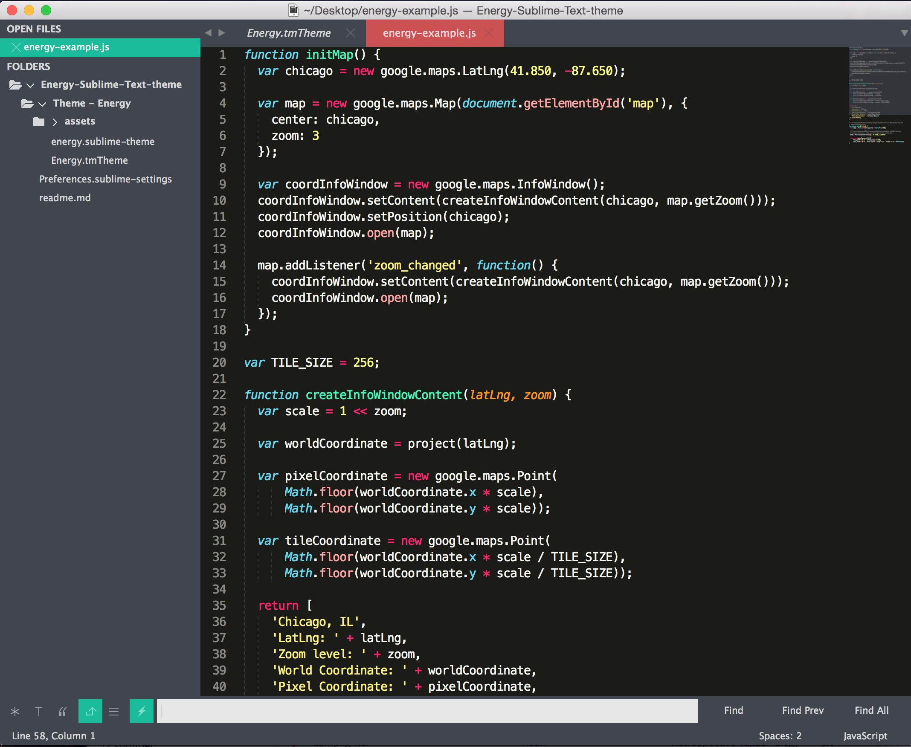

# Energy

Energy is a flat, colorful theme/UI combo for Sublime Text.



## Install

### Manual

1. [Download the .zip](https://github.com/sandralundgren/Energy-Sublime-Text-theme/archive/master.zip)
2. Unzip and rename the folder to `Theme - Energy`
3. Copy the folder into `Packages` directory, which you can find using the menu item `Preferences -> Browse Packages...` in Sublime Text

## Setup

Activate both the UI theme and color scheme by modifying your user preferences file, which you can find using the menu item `Preferences -> Settings - User` in Sublime Text or <kbd>cmd</kbd><kbd>,</kbd> on a Mac.

## Example settings
```
{
  "theme": "Energy.sublime-theme",
  "color_scheme": "Packages/Theme - Energy/Energy.tmTheme",
}
``` 
